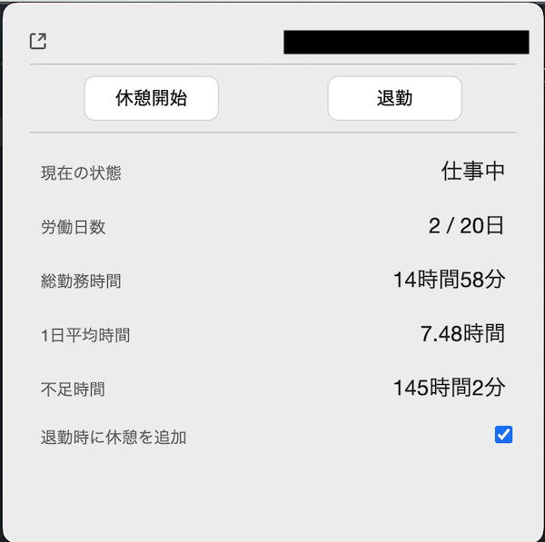

# freee勤怠くん

freee の勤怠を簡単にするデスクトップアプリケーション。タスクトレイに常駐するソフトです。

freeeeに無い点として、一ヶ月のトータルの出勤数と一日の平均時間(8時間以上であれば締日に残業が発生していること)を算出します。

## インストール

[リリースページ](https://github.com/hiroppy/freee-kintai-kun/releases)から win/mac がダウンロードできます。

mac に関しては、コード署名してないので、application からアイコンを選択し、右メニュー => `開く`で開く必要があります。

## やる気(or 需要)出たら

- なぐり書きコードを直す
- UI 整える
- アイコンつくる
